# Architecture

AI Video Production Skills is a loop-driven, artifact-based production operating system designed to:

- Prevent narrative drift
- Enforce continuity
- Control regeneration loops
- Bound costs
- Enable model-agnostic routing
- Scale to long-form production

This document defines the structural layers and how they interact.

---

## 1. System Layers

The framework operates across six layers:

1. Narrative Layer
2. Validation Layer
3. Continuity Layer
4. Production Layer
5. Governance Layer
6. Observability Layer

Each layer enforces gates before progression.

---

## 2. Layer Breakdown

### Narrative Layer

Defines story structure and character logic.

**Skills:** story-architect, script-breakdown, character-psychology, dialogue-consistency-check

**Purpose:** Build coherent arcs, prevent structural weakness, ensure character stability.

**Output:** BEATS, SCENES, BREAKDOWN, PSYCH reports

---

### Validation Layer

Ensures realism and credibility.

**Skills:** research-agent, plausibility-auditor, cultural-check, narrative-red-team, audience-simulator

**Purpose:** Ground narrative in realism, stress-test structure, validate audience clarity, detect plot holes.

**Output:** TRUTH packets, PLAUS reports, CULTURE reports, REDTEAM reports, AUDIENCE reports

---

### Continuity Layer

Maintains canonical world coherence.

**Skills:** character-lock, set-lock, voice-lock, world-state-tracker, continuity-supervisor

**Purpose:** Prevent visual drift, personality drift, prop teleportation, and timeline collapse.

**Output:** LOCK artifacts, WORLD_STATE, STATE_DIFF, CONTINUITY_REPORT

---

### Production Layer

Transforms validated scenes into generatable units.

**Skills:** shot-planner, prompt-packager, storyboard-generator, qc-grader, regen-analyzer

**Purpose:** Optimize shot geometry, build deterministic GenPacks, validate outputs, adapt to failure patterns.

**Output:** SHOTLIST, GENPACK, STORYBOARD, QC_BATCH, REGEN_RULES

---

### Governance Layer

Controls model selection and financial discipline.

**Skills:** cost-optimizer, model-router, budget-gates

**Purpose:** Project cost, enforce budget caps, route to cheapest viable tier, prevent runaway regeneration.

**Output:** COST_REPORT, ROUTING_DECISION, BUDGET_STATUS

---

### Observability Layer

Records system execution for audit and improvement.

**Skill:** run-logger

**Purpose:** Log every skill execution; track cost, tier usage, and failure patterns; enable analytics.

**Output:** RUN_LOG

---

## 3. Closed-Loop System

The system is not linear — it is composed of controlled loops.

### Narrative Loop
```
story-architect → script-breakdown → character-psychology → narrative-red-team → audience-simulator
```
If FAIL → revise → version increment → rerun

### Validation Loop
```
research-agent → plausibility-auditor → cultural-check
```
If FAIL → revise → rerun

### Continuity Loop
```
world-state-tracker → continuity-supervisor
```
If FAIL → revise → update state → rerun

### Production Loop
```
shot-planner → prompt-packager → generate → qc-grader
```
If FIX → minor adjustment  
If FAIL → regen-analyzer → repackage → regenerate

### Cost Loop
```
cost-optimizer → model-router → budget-gates
```
If over budget → simplify → reroute → re-evaluate

---

## 4. Global Hard Stops

System halts if:

- Budget exceeded
- Lock violation unresolved
- World-state contradiction persists
- Regen limit exceeded without analyzer
- Log entry missing
- Artifact overwritten

Hard stop requires human override.

---

## 5. Artifact-Based Memory Model

The system does not rely on chat memory. It relies on versioned artifacts:

LOCK artifacts, WORLD_STATE, STATE_DIFF, QC_BATCH, REGEN_RULES, COST_REPORT, RUN_LOG

All artifacts are versioned, immutable, append-only (logs), and schema-consistent.

> If it is not in an artifact, it does not exist.

---

## 6. Model Routing Architecture

Skills declare a required capability tier:

- **Tier 1** — Throughput
- **Tier 2** — Judgment
- **Tier 3** — Premium Arbitration
- **Research Tier**
- **Vision Tier**

`model-router` selects the cheapest viable model. Escalation only occurs after gate failure.

---

## 7. Cost Enforcement Architecture

Cost discipline is layered:

1. Pre-run projection (cost-optimizer)
2. Tier routing (model-router)
3. Regen cap enforcement (budget-gates)
4. Hard stop at cap threshold
5. Logging for audit

Proxy-first workflow required before final resolution.

---

## 8. Design Guarantees

This architecture ensures no silent drift, no hidden state, no unbounded regen loops, no silent model escalation, no unlogged cost, no overwritten artifacts, and deterministic reproducibility.

---

## 9. Why This Architecture Exists

Most AI storytelling systems fail because they rely on chat memory, skip validation gates, ignore cost discipline, escalate models blindly, lack world-state tracking, and have no regeneration learning loop.

This architecture addresses those failures directly. It is designed for 50+ scene productions, hundreds of shots, multi-model routing, multi-agent orchestration, long-running pipelines, and continuous refinement cycles.

---

## 10. System Diagram

```mermaid
flowchart TD

A[Narrative Layer] --> B[Validation Layer]
B --> C[Continuity Layer]
C --> D[Production Layer]
D --> E[QC]
E -->|PASS| F[Finalize]
E -->|FAIL| G[Regen Analyzer]
G --> D

D --> H[Cost Optimizer]
H --> I[Model Router]
I --> J[Budget Gates]
J -->|OK| D
J -->|STOP| K[Hard Stop]

subgraph Governance
  H
  I
  J
end

subgraph Observability
  L[Run Logger]
end

A --> L
B --> L
C --> L
D --> L
E --> L
H --> L
I --> L
J --> L
```


---

## 11. Extensibility

New skills must conform to the agent contract, produce versioned artifacts, define gate and escalation behavior, integrate into the loop architecture, and respect both model-policy and budget-policy. Execution must be logged.

> If a skill weakens discipline, it does not belong.

---

## 12. Philosophy

This repository treats AI storytelling as infrastructure — not inspiration.

> Structure before generation.  
> Gates before scale.  
> Loops before escalation.  
> Artifacts before memory.  
> Discipline before cost.
